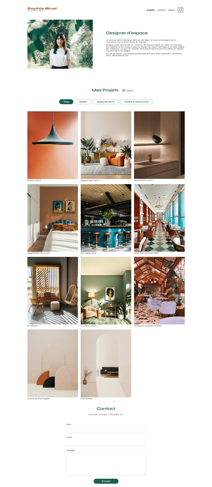
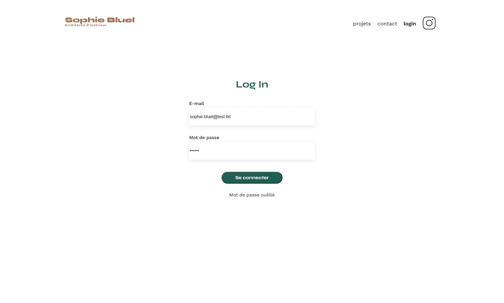
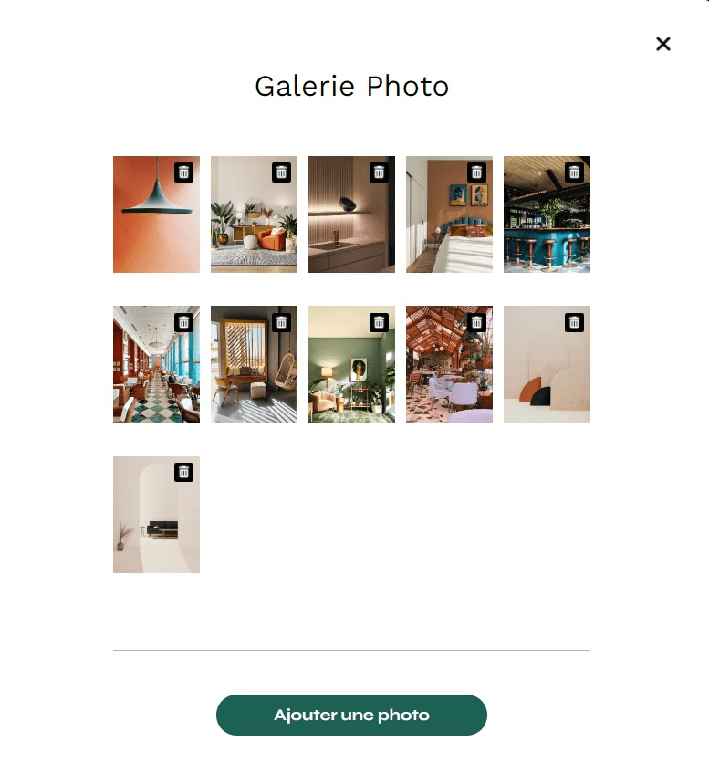
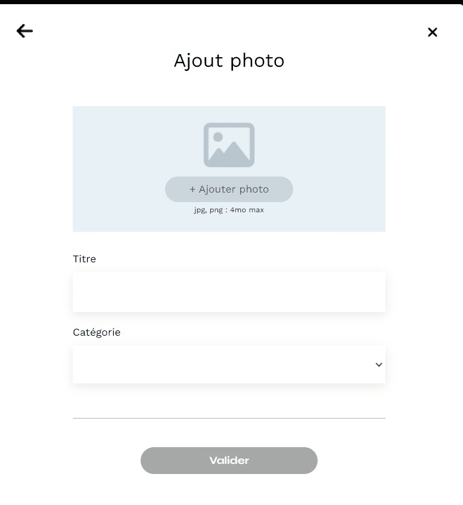
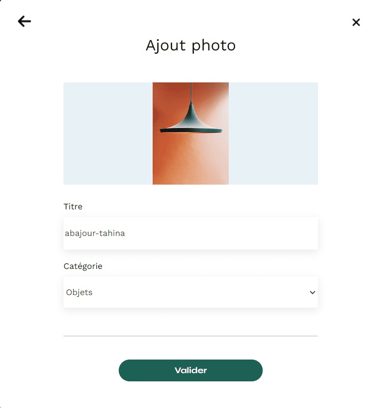

# Portfolio-architecte-sophie-bluel
This project is part of a web development training course.

It is requested to add functionalities to the site of an interior designer.

The main missions are:

- Use the API to read, create and delete works and authenticate the user.
- Add sorting of projects by category in the gallery.
- Integrate login page and modals.
- Manage content display based on user login.

here are different views of the site:

## Main page



## Login Page



## Modal for deleting works



## Modal for add works






## Note

If you use a plugin that reloads your web page as soon as a file is modified in your IDE (like liveserver), only open the frontend directory in your IDE to avoid a page reload during the creation and deletion phases because the content of the Backend directory is modified.

For launch the backend from the Frontend directory
```bash
cd ../Backend && npm start
```